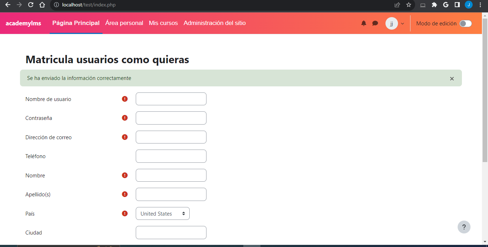

# Registro y Matriculación de Usuarios en Moodle gratis para todo el mundo

Este proyecto proporciona un formulario web para registrar usuarios en Moodle y matricularlos automáticamente en cursos específicos.

## Requisitos

Asegúrate de tener instalado lo siguiente antes de ejecutar este proyecto:

- Moodle instalado y configurado.
- PHP en tu servidor web.
- Acceso de administrador en Moodle para configurar permisos.

## Instalación

1. Clona o descarga este repositorio en tu servidor web.
2. Asegúrate de que la carpeta del proyecto sea accesible a través de tu navegador web. Puedes ubicarla en la carpeta de tu servidor web (por ejemplo, `htdocs` en XAMPP).
3. Configura Moodle:

   - Accede al panel de administración de Moodle.
   - Configura adecuadamente las opciones de autenticación y matriculación manual en Moodle según tus necesidades.
4. Configura el archivo `config.php`:

   - Asegúrate de que la ruta de Moodle (`$CFG->dirroot`) esté configurada correctamente en `config.php`.
5. Accede al formulario:

   - Abre tu navegador web y navega a la URL donde está ubicado este proyecto (por ejemplo, `http://localhost/tu_proyecto`).
6. Completa el formulario con los datos del usuario y el ID del curso al que deseas matricularlo.
7. Envía el formulario y verifica que el usuario se haya registrado y matriculado en el curso con éxito.

## Uso

- Abre el formulario web proporcionado por este proyecto.
- Completa el formulario con la información del usuario y el ID del curso.
- Envía el formulario para registrar al usuario y matricularlo en el curso.

## Contribución

Si deseas contribuir a este proyecto, ¡siéntete libre de hacerlo! Puedes enviar problemas (issues) y solicitudes de extracción (pull requests) en GitHub.

## Screedshop

## Licencia

Este proyecto está bajo la Licencia MIT. Consulta el archivo [LICENSE](LICENSE) para obtener más detalles.
